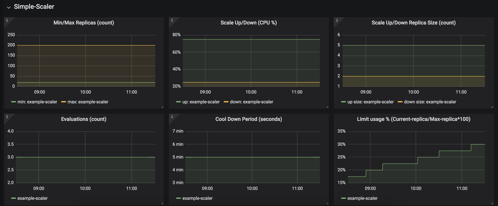

# Custom Prometheus exporter for exporting simple-scaler (pod auto-scaler) metrics
[](https://opensource.org/licenses/MIT)

## Overview
This is as a supporting app for 'simple-scaler' (pod-autoscaler) [GitHub](https://github.com/denis-jdsouza/simple-scaler) - _Repo_.\
Metrics for 'simple-scaler' were not available in Prometheus hence the need for this app.\
This Python app polls Kubernetes custom-resource (Scaler) metrics over API and exports them via HTTP for Prometheus consumption.

## Metrics exported
```
kube_simplescaler_spec_min_replicas
kube_simplescaler_spec_max_replicas
kube_simplescaler_spec_cool_down_period_seconds
kube_simplescaler_spec_evaluations
kube_simplescaler_spec_scale_down
kube_simplescaler_spec_scale_up
kube_simplescaler_spec_scale_down_size
kube_simplescaler_spec_scale_up_size
```

## Example output
export POD_NAME=$(kubectl get pods -l "app=simplescaler-exporter" -o jsonpath="{.items[0].metadata.name}")  
kubectl port-forward $POD_NAME 8000:8000 &

open in browser: (http://127.0.0.1:8000/)

```
# HELP kube_simplescaler_spec_min_replicas Minimum number of replicas
# TYPE kube_simplescaler_spec_min_replicas gauge
kube_simplescaler_spec_min_replicas{namespace="default",scaler="default-scaler",target="stress"} 1.0
# HELP kube_simplescaler_spec_max_replicas Maximum number of replicas
# TYPE kube_simplescaler_spec_max_replicas gauge
kube_simplescaler_spec_max_replicas{namespace="default",scaler="default-scaler",target="stress"} 12.0
# HELP kube_simplescaler_spec_cool_down_period_seconds Cooldown period after scaleup/scaledown
# TYPE kube_simplescaler_spec_cool_down_period_seconds gauge
kube_simplescaler_spec_cool_down_period_seconds{namespace="default",scaler="default-scaler",target="stress"} 180.0
# HELP kube_simplescaler_spec_evaluations Number of evaluations before scaling happens
# TYPE kube_simplescaler_spec_evaluations gauge
kube_simplescaler_spec_evaluations{namespace="default",scaler="default-scaler",target="stress"} 2.0
# HELP kube_simplescaler_spec_scale_down Scale Down threshold in CPU utilization percentage
# TYPE kube_simplescaler_spec_scale_down gauge
kube_simplescaler_spec_scale_down{namespace="default",scaler="default-scaler",target="stress"} 30.0
# HELP kube_simplescaler_spec_scale_up Scale Up threshold in CPU utilization percentage
# TYPE kube_simplescaler_spec_scale_up gauge
kube_simplescaler_spec_scale_up{namespace="default",scaler="default-scaler",target="stress"} 70.0
# HELP kube_simplescaler_spec_scale_down_size Number of pods to scale down
# TYPE kube_simplescaler_spec_scale_down_size gauge
kube_simplescaler_spec_scale_down_size{namespace="default",scaler="default-scaler",target="stress"} 2.0
# HELP kube_simplescaler_spec_scale_up_size Number of pods to scale up
# TYPE kube_simplescaler_spec_scale_up_size gauge
kube_simplescaler_spec_scale_up_size{namespace="default",scaler="default-scaler",target="stress"} 2.0
```

## Dependencies
- Prometheus configured to scrape metrics from service endpoint
- CRD 'Scaler' should be deployed in the Kubernetes cluster [GitHub](https://github.com/denis-jdsouza/simple-scaler) - _Repo_

## Prometheus Job Details
```
- job_name: kubernetes-service-endpoints
  honor_timestamps: true
  scrape_interval: 15s
  scrape_timeout: 7s
  metrics_path: /metrics
  scheme: http
  kubernetes_sd_configs:
  - role: endpoints
  relabel_configs:
  - source_labels: [__meta_kubernetes_service_annotation_prometheus_io_scrape]
    separator: ;
    regex: "true"
    replacement: $1
    action: keep
  - source_labels: [__meta_kubernetes_service_annotation_prometheus_io_scheme]
    separator: ;
    regex: (https?)
    target_label: __scheme__
    replacement: $1
    action: replace
  - source_labels: [__meta_kubernetes_service_annotation_prometheus_io_path]
    separator: ;
    regex: (.+)
    target_label: __metrics_path__
    replacement: $1
    action: replace
  - source_labels: [__address__, __meta_kubernetes_service_annotation_prometheus_io_port]
    separator: ;
    regex: ([^:]+)(?::\d+)?;(\d+)
    target_label: __address__
    replacement: $1:$2
    action: replace
  - separator: ;
    regex: __meta_kubernetes_service_label_(.+)
    replacement: $1
    action: labelmap
  - source_labels: [__meta_kubernetes_namespace]
    separator: ;
    regex: (.*)
    target_label: kubernetes_namespace
    replacement: $1
    action: replace
  - source_labels: [__meta_kubernetes_service_name]
    separator: ;
    regex: (.*)
    target_label: kubernetes_name
    replacement: $1
    action: replace
```

## Service Annotations
```
metadata:
  annotations:
    prometheus.io/port: "8000"
    prometheus.io/scrape: "true"
```

## Grafana Monitoring Graphs


## License
Code released under the [MIT License](https://opensource.org/licenses/MIT)
